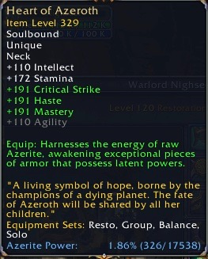

HeartOfAzerothTooltip
-------------
Interface add-on for World of Warcraft: Battle for Azeroth.

This add-on expands the in-game tooltip when hovering the Heart of Azeroth item to reveal the current progress on in as a percentage and "x/y".

By default, the experience bar can be configured in-game by players to show the Azerite progress of your Heart of Azeroth item. However, if your experience bar is hidden, e.g. if using a completely different UI package, you no longer have the luxury of monitoring your Azerite levels. This add-on combats that discrepancy.

# Installation

Copy the folder `Interface/AddOns/HearthOfAzerothTooltip` to `<WOWINSTALL>/Interface/AddOns/HearthOfAzerothTooltip`, where `<WOWINSTALL>` is the location of your World of Warcraft installation directory, e.g.:

- On Windows: `C:\Program Files (x86)\World of Warcraft`
- On Mac: `/Application/World of Warcraft`

# Credits

## Author

- Kasper Søfren (soefritz@gmail.com)

## Inspiration

Largely based on Adamod: http://www.wowinterface.com/downloads/info24741-Adamod.html
